## Kstu_Sozduk_app
Приложение 

## Сөздүн күчү — 
это мобильное приложение-словарь тренажер, предназначенное для эффективного изучения слов на кыргызском языке. Оно помогает пользователям тренировать и запоминать новые слова, проходя различные игровые упражнения. В приложении реализована авторизация, статистика пользователей и лидерборд, а также интерактивный график с результатами.

## Основные особенности

### Регистрация и авторизация: 
Приложение позволяет пользователям зарегистрироваться и войти в систему через Firebase Authentication.
### Словарь тренажер:
Уникальная система тренажера помогает пользователям учить слова на кыргызском языке через игровые механики.
### Статистика пользователей:
Приложение собирает статистику, показывая пол, возраст и другие данные пользователей.
### Топ-10 пользователей:
Лидерборд с результатами игроков, показывающий лучших пользователей по результатам игры.
### Диаграммы: 
В приложении используется библиотека Charts для визуализации статистики, показывая графики по прогрессу пользователей.
### MVVM архитектура: 
Приложение построено на основе архитектуры MVVM (Model-View-ViewModel), что позволяет поддерживать чистый и масштабируемый код.
### SnapKit: 
Для создания интерфейса используется SnapKit, что облегчает работу с Auto Layout и ускоряет разработку UI.
## Технологии

### iOS: Swift, SnapKit
### DateBase: Firebase Firestore, Firebase Authentication
### Архитектура: MVVM
### Графики: Charts (для отображения статистики и графиков)
## Установка

1.Склонируйте репозиторий:
"git clone https://github.com/AselMirbek/Kstu_Sozduk_app.git"
2.Откройте проект в Xcode.
3.Убедитесь, что у вас установлены все необходимые зависимости, и выполните команду:
pod install
4.Откройте .xcworkspace файл и запустите приложение на симуляторе или реальном устройстве.
Использование

При первом запуске приложения пользователю будет предложено зарегистрироваться или войти.
После успешной регистрации или входа в систему, пользователь попадет в главное меню с доступом к тренажеру для изучения слов.
Приложение отслеживает прогресс пользователя и отображает статистику, включая топ-10 игроков.
Статистика доступна в виде графиков и таблиц, предоставленных через Charts.

## Скриншоты

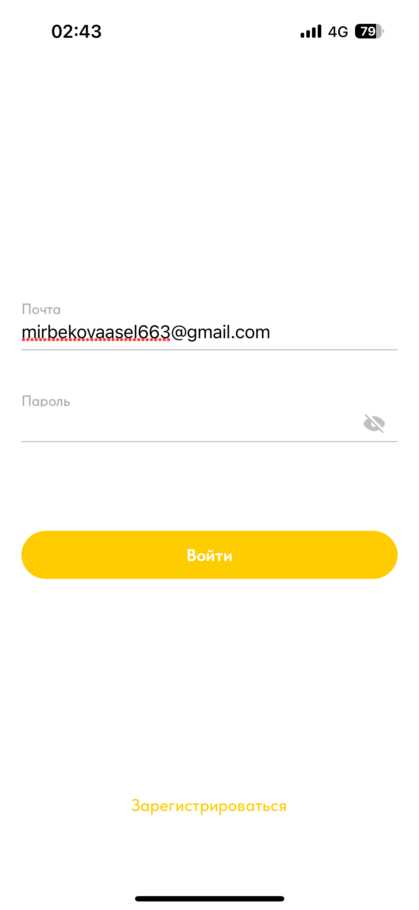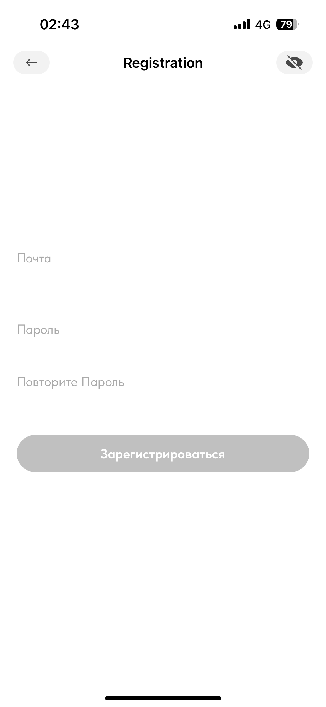
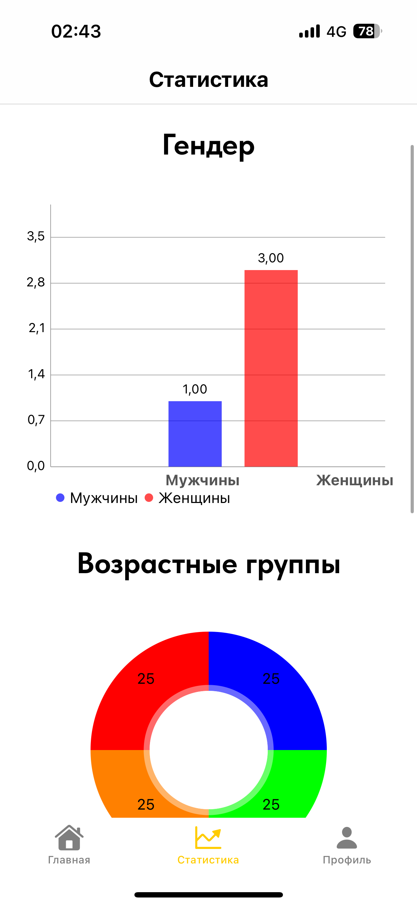
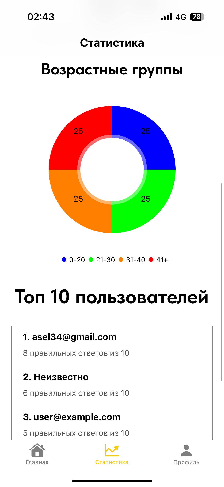
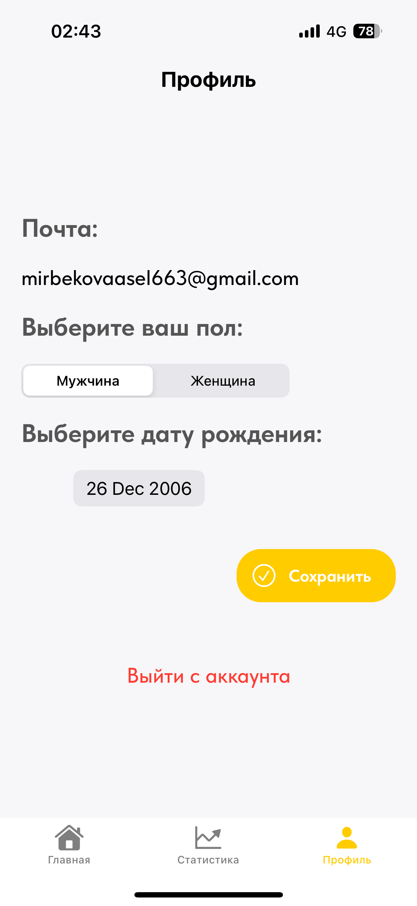
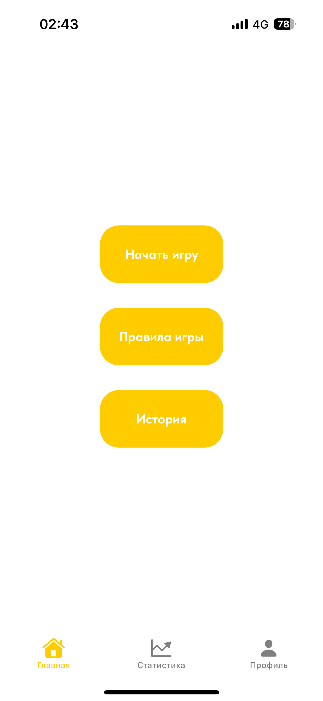
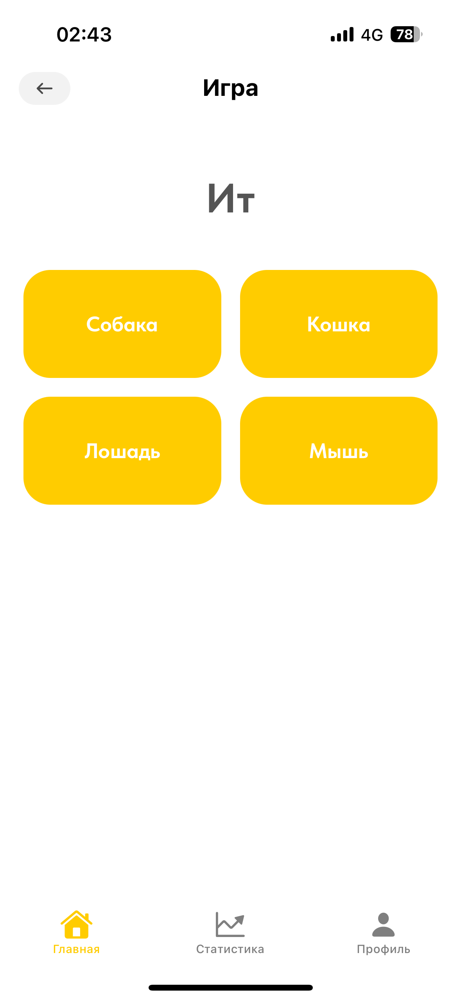
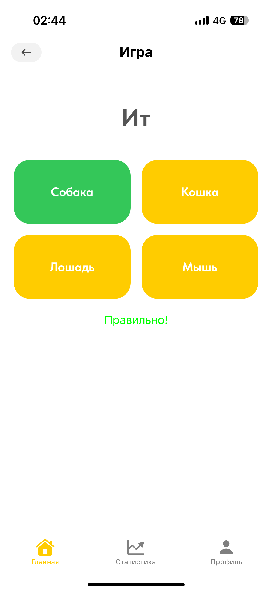
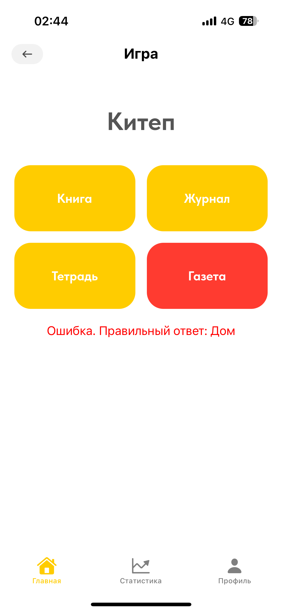
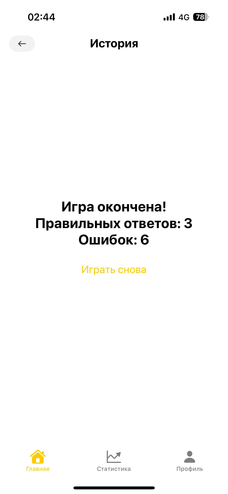
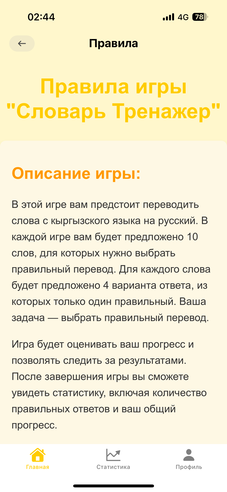
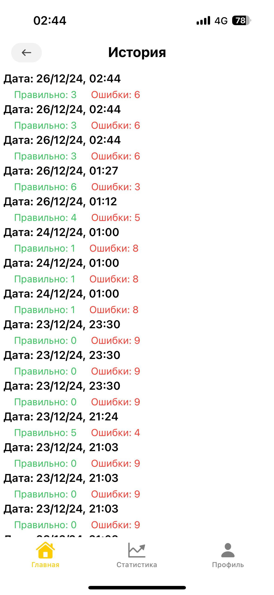

## Лицензия

Этот проект лицензирован под лицензией MIT. Подробности см. в файле LICENSE.
